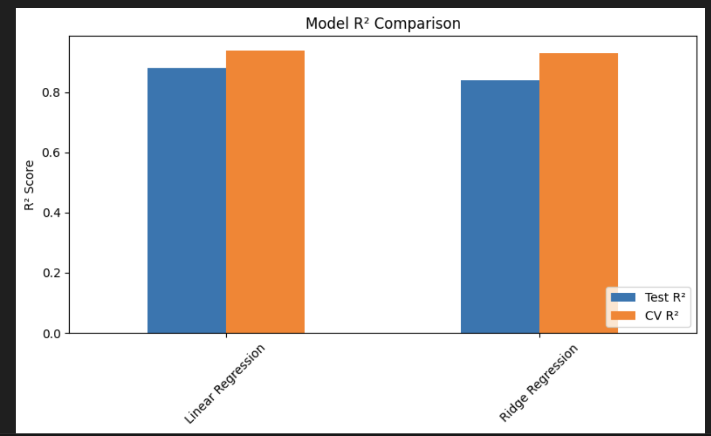

# -MSCS_634_ProjectDeliverable

# Warehouse and Retail Sales Data Mining Project

## 📄 Introduction

This project is designed to provide a comprehensive experience in data mining using a real-world dataset from Montgomery County’s Warehouse and Retail Sales records. The dataset contains detailed information on alcohol-related retail transactions and warehouse activities, including sales quantities and monetary values, item types, suppliers, and time periods.

The overall objective of this project is to apply key data mining techniques — including data preprocessing, feature engineering, regression modeling, classification, clustering, and association rule mining — to extract meaningful insights and prepare for predictive modeling tasks.

---

## 🚀 Project - Deliverable 1: Data Collection, Cleaning, and Exploration

### Dataset Overview and Justification

The dataset, **Warehouse and Retail Sales**, contains 307,645 records and 9 attributes. It was sourced from the Montgomery County open data portal and provides a rich set of features such as:
- Time-related fields (`YEAR`, `MONTH`)
- Supplier information (`SUPPLIER`)
- Item details (`ITEM CODE`, `ITEM DESCRIPTION`, `ITEM TYPE`)
- Numeric sales measures (`RETAIL SALES`, `RETAIL TRANSFERS`, `WAREHOUSE SALES`)

This dataset is appropriate for the project because:
- It exceeds the minimum size requirements (500+ records, 8+ attributes).
- It reflects a real-world retail business context, ideal for practicing data mining tasks such as regression, classification, clustering, and association rule mining.
- It contains both categorical and numeric variables, providing diverse opportunities for analysis.

---

### Data Cleaning Summary

The following cleaning steps were performed:
- **Missing value handling:**
  - Imputed missing `SUPPLIER` and `ITEM TYPE` values as `'Unknown'`.
  - Dropped 3 rows where `RETAIL SALES` was missing.

- **Duplicate records:**  
  - Verified that no duplicates existed; no action needed.

- **Negative sales values:**
  - Removed rows where `RETAIL SALES`, `RETAIL TRANSFERS`, or `WAREHOUSE SALES` were negative to ensure only positive transactions remain.

- **Outliers:**
  - Large positive outliers were retained because they represent valid large transactions (e.g., bulk purchases) and are business-relevant.

After cleaning, the dataset contains **305,803 records** and **no missing or invalid values**.

---

### Exploratory Data Analysis (EDA) Summary

Key findings from the EDA include:

- **Distributions:**
  - All three numeric sales variables (`RETAIL SALES`, `RETAIL TRANSFERS`, `WAREHOUSE SALES`) are strongly right-skewed with most transactions at low values and some rare but valid high-value transactions.

- **Top item types:**
  - `WINE` is by far the most common item type, followed by `LIQUOR` and `BEER`. These three categories dominate the dataset.

- **Correlation analysis:**
  - Strong positive correlation between `RETAIL SALES` and `RETAIL TRANSFERS` (0.96), suggesting they tend to increase together.
  - Moderate correlation between warehouse sales and retail activity (~0.49).

---

### Challenges Encountered

- Negative sales values were present and required careful treatment (interpreted as possible refunds or adjustments but removed due to lack of metadata context).
- Skewness and outliers are prominent in sales amounts, requiring consideration of transformation or robust modeling techniques in future deliverables.

---

## 📦 Repository Contents

- `Deliverable1_EDA.ipynb`: Jupyter notebook containing all code, visualizations, and detailed comments for Deliverable 1.
- `README.md`: This documentation file describing dataset summary, cleaning steps, EDA insights, and challenges.

---
# Deliverable 2: Regression Modeling and Performance Evaluation

## 📄 Dataset Summary
This project continues from Deliverable 1 using the **Warehouse and Retail Sales dataset** (305,803 cleaned records).  
The goal is to predict `RETAIL SALES` using features such as `YEAR`, `MONTH`, `SUPPLIER`, `ITEM TYPE`, `RETAIL TRANSFERS`, and `WAREHOUSE SALES`.

---

## ⚙️ Modeling Process

### Feature Engineering
- **Categorical encoding**: `SUPPLIER` and `ITEM TYPE` were encoded using OneHotEncoder to convert categories into numerical features.
- **Numerical features**: Retained as-is (`YEAR`, `MONTH`, `RETAIL TRANSFERS`, `WAREHOUSE SALES`).
- Target variable: `RETAIL SALES`.

### Train/Test Split
- 80% training set, 20% test set.

---

## 🤖 Regression Models

Two models were built and evaluated:
- **Linear Regression**
- **Ridge Regression** (regularization to handle multicollinearity and reduce overfitting)

---

## 📈 Model Evaluation

Both models were evaluated using:
- **Test R²**
- **Test MSE**
- **Test RMSE**
- **5-fold Cross-Validation R²**

### Evaluation Results:

| Model              | Test R²  | Test MSE | Test RMSE | CV R²  |
| ------------------ | -------- | -------- | --------- | ------ |
| Linear Regression  | 0.8809   | 127.04   | 11.27     | 0.9388 |
| Ridge Regression   | 0.8389   | 171.88   | 13.11     | 0.9278 |

---

### Insights and Observations
- **Linear Regression outperformed Ridge Regression** on both the test set and cross-validation:
  - Higher R² (0.8809 vs 0.8389)
  - Lower RMSE (11.27 vs 13.11)

- **Ridge Regression slightly reduced variance but did not improve overall predictive power** on this dataset.

- The high R² values suggest that the current set of features explains a significant portion of variance in `RETAIL SALES`.

---

## 🔔 Challenges Encountered
- The dataset exhibited **strong skewness and a large number of small transactions**:
  - No transformation (e.g., log) was applied here, but this could further improve performance.
  
- Categorical encoding resulted in a **large feature space due to many suppliers**:
  - Ridge regularization was tested to mitigate potential overfitting.

---
✅ **Next Steps:**  
- Further improvements may involve feature selection, log transformation to normalize skewness, and evaluating other regression algorithms (e.g., Lasso, ElasticNet).

